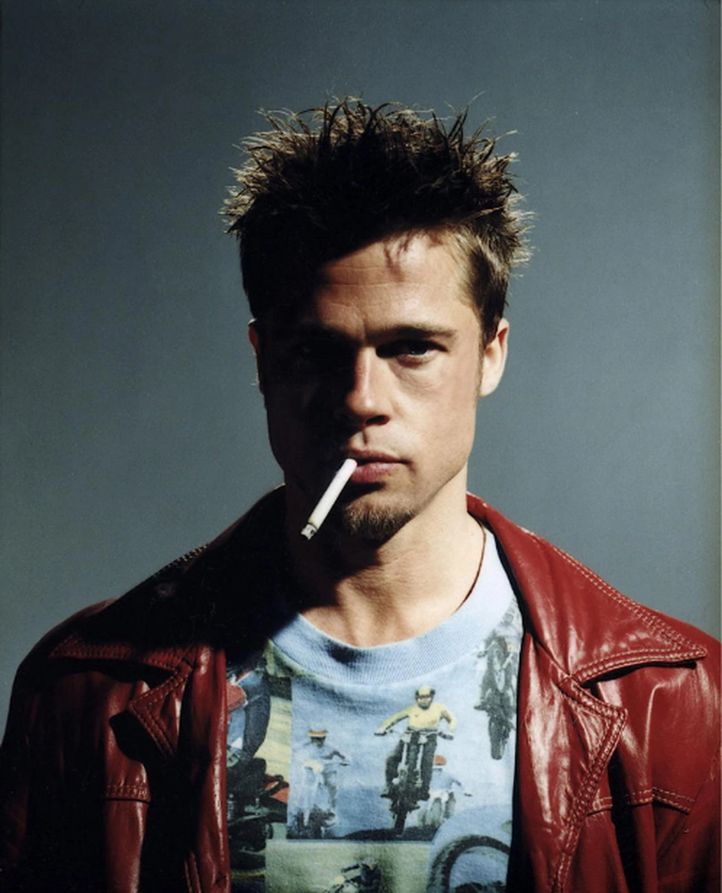

## Arthur Ianbaev
My real photo:

## tg: @H3APTYP
## GH: https://github.com/ArthurIanb
## CodeWars😞: https://www.codewars.com/users/Arthur_ianb
## LeetCode😀: https://leetcode.com/u/WHO_AM_ARTHUR/
At this moment I am studying in Saint-Petersburg state University at 'Programming and Information Technology'  program
I have been interested in programming since an early age, my hobbies are python and brawl stars ~~(37k)~~ (42k), I am studying on the “” course, I identify myself as a rn
### Teck skills:
- C++
- Python
- Django
- FastAPI
- PostgreSQL
- Git
- Linux
- English(B1)

### Soft Skills
- Easy To Learn
- whole lotta time
